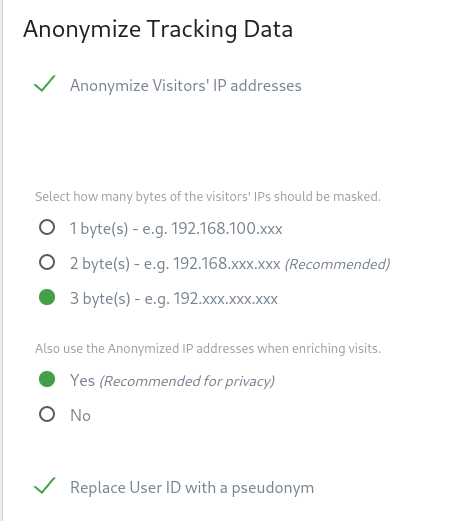

# [kycnot.me](https://kycnot.me)
kycnot.me is a simple yet useful web page. It lists trusted Exchanges where you can buy / trade Bitcoin or Monero. You can easily compare and decide what's best for you.

**CONTENTS**
* [Legend of icons](#legend-of-icons)
* [Why this](#why-this)
* [Why only Bitcoin and Monero](#why-only-bitcoin-and-monero)
* [Website has trackers?](#website-has-trackers)
* [Contribute](#contribute)
* [Donate](#donate)

## Legend of icons
Legend of icons is now available on the website itself.

## Why this
Cryptocurrencies are meant to make a change on the way we pay and exchange goods. They are made to untie the dependency between the users (customers) and the centralized entities that are in control (law enforced) of our economy (e.g. Banks, FED, etc.).

KYC and AML exchanges are the most common nowadays, they act exactly like a bank when using their wallets (most newbies or “traders” do so). You (usually) don't own any private key, so the funds aren't fully yours, they own your keys (if there are any keys that belong to you). They also require you to identify yourself in order to operate there (e.g. photo of your ID). All of this together goes against the most valuable benefits of cryptocurrencies.

With KYCNOT.ME I want to make it easier for people to find trustworthy ways to buy, exchange, trade and use cryptos without needing to identify themselves, and preserving the decentralized and self-governed essence of Cryptocurrencies.

### Why only Bitcoin and Monero
Bitcoin because is the biggest, with the most market cap, most adoption and most used among all cryptos. Monero because it is the true digital money, the only one that preserves privacy by design and brings true fungibility.

### Website has trackers?
Actually I have set up the free version of Matomo web analytics. [Matomo](https://matomo.org/) gathers analytics in a completely privacy-respecting way. I will be setting up a self-hosted version of Matomo so I will completely control the data myself.

Matomo is [completely open source](https://github.com/matomo-org/matomo), so the code can be studied. If you have any doubts I encourage you to take a look at Matomo's code and their website.

I want to have analytics for my site as I want to know if it is worth it to continue developing features for it, or if I have to improve certain things. The analytics data will **never** be sold.

I will leave screenshots of the Matomo privacy configuration I have set:

## Contribute
Suggestions about listing new Exchanges must be commented [here](https://github.com/pluja/kycnot/issues/15)

Contributions are very welcome. Any suggestion, recommendation, correction, idea... Just open a Github issue and I'll fix it as quick as I can.

I want the site to use as little JS as possible, so all suggestion will be evaluated before being added. Also, I won't have any backend in the near future, only frontend. I may be adding backend at some point if the project grows.

[The list of changes can be found here](CHANGELOG.md)

I'll be setting up a self-hosted Matomo instance for analytics (Not only for this site, but for several personal projects).

**FYI: I'm not a web developer, so don't expect web design / development to be any great.**

> The project is licensed under GNUPLv3

### Donate
* Bitcoin: '1GafZ243XHrpteRJ4gNkm91xZHnmYUR96L'
* Monero: '8AAeZCQRwT98qH74qwFTSJ8XRJAhzhye4JiJFbkUwvoHeQ2cCHs7Q7YUgdL1tJsJFbfBdqsqSrUwcMZmvBLZPwjVUR2Ej2h'
